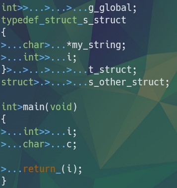
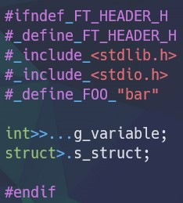
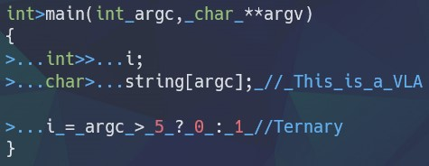

# The Norm

## THe Norm(コード規則)をテキストに起こしました。

### 命名規則

- 構造体名の先頭は s_ です。
- typedef 名の先頭は t_ です。
- 共用体 (union) 名の先頭は u_ です。
- 列挙型 (enum) 名の先頭は e_ です。
- グローバル変数名の先頭は g_ です。
- 変数名と関数名に利用できるのは、小文字、数字、’_’(アンダースコア)のみです (Unix Case)。
- ASCII コード表以外の文字は禁止です。
- 変数名、関数名、その他の識別子名は、スネークケースでなくてはなりません。大文字は禁止です。単語毎にアンダースコアで区切られていなくてはなりません。
- 全ての識別子 (関数、マクロ、型、変数等) 名は英語でなければなりません。
- オブジェクト (変数、関数、マクロ、型、ファイル、ディレクトリ) 名は、最大限に明示的かつ覚えやすくなければなりません。
- 定数 (const)、 静的 (static) 変数以外のグローバル変数を使用することは禁止であり、 Norm Error に該当します。ただし、課題で明示的に許可されている場合を除きます。
- ファイルはコンパイルが可能でなければなりません。コンパイルが不可能なファイルは、 Norm の基準に達しているとはみなされません。

### フォーマット

- コードはインデント (字下げ) されなければなりません。半角スペース (以降「スペース」と呼ぶ) ではなく、半角文字4つ分の長さのタブを用いること。
- **各関数は25行以内**でなくてはなりません。なお、この行数には、関数に伴う波括弧は含まれません。
- **各行は80文字以内**でなくてはなりません。コメントも同様です。なお、1つのタブは1文字としてカウントされます。
- 各関数は、改行にて区切られていなくてはなりません。どのようなコメントやプリプロセッサ命令でも、関数の直前に置けます。改行は直前の関数の後に入れてください。
- **命令は1行につき1つ**です。
- 空行にスペースやタブがあってはなりません。
- 行末にスペースやタブがあってはなりません。
- スペースを連続しておいてはなりません。
- 新しい行の開始は、各波括弧や制御構造の終端の後でなければなりません。
- 行末以外では、カンマやセミコロンの直後にスペースが続いていなければなりません。
- 演算子や被演算子 (オペランド) にはスペースが続いていなければなりません。ただし、型に関するキーワード (int, char, float 等) と sizeof は例外です。
- **スコープ内での変数宣言は、同じ列にインデント**されていなくてはなりません。
- ポインタに伴うアスタリスク (’*’) は、変数名に隣接していなくてはなりません。
- **変数の宣言は、1行につき1つ**です。
- 宣言と初期化を同一行内で行ってはなりません。ただし、グローバル変数 (許可されている場合) 、静的 (static) 変数、定数 (constant) は例外です。
- 宣言は、関数内の先頭で行われなければなりません。
- 関数内にて、変数の宣言とその関数の残りの部分の間には、空行が1つ挟まれていなくてはなりません。関数内では、他の空行は禁止です。
- 多重代入は厳禁です。
- 命令や制御構造の後に改行を置いても良いですが、括弧や代入演算子にインデントを加えなくてはなりません。演算子は行頭になくてはなりません。
- 制御構造 (if, while...) は、括弧を伴っていなくてはなりません。ただし、制御構造に含まれているのが一行のみの場合や、条件が単一の場合を除きます。

一般的な例:

### 関数

- 関数に一度に渡せる引数は、4つまでです。
- 引数を受け取らない関数は、宣言部分の引数として ‘void’ と明示しなくてはなりません。
- 関数のプロトタイプ宣言内の仮引数は、命名されていなくてはなりません。
- 各関数は、空行によって区切られていなくてはなりません。
- **1つの関数内で宣言できる変数は5つまで**です。
- **関数内の返り値は、括弧で囲まれていなくてはなりません。**
- 各関数では、**返り値の型と関数名の間にタブが1つ**挟まれていなくてはなりません。

### Typedef、構造体 (struct)、列挙型 (enum)、共用体 (union)

- 構造体、列挙型、共用体の宣言の際は、タブを加えなさい。
- 構造体、列挙型、共用体の型の変数を宣言する際は、**型にスペースを1つ**加えなさい。
- 構造体、列挙型、共用体を typedef により宣言する際は、インデントに関する全てのルールが適用されます。typedef の名前は構造体、列挙型、共用体の名前と同じ列に並べられなくてはなりません。
- **全ての構造体名は同じ列にインデント**されていなくてはなりません。
- **.c ファイル内での構造体の宣言は禁止**です。

### ヘッダ

- ヘッダファイルへの記載が許可されている要素は、次の通りです。ヘッダ (システムによるもの、自作のもの) のインクルード、宣言、プロトタイプ宣言、マクロ。
- インクルードは全て、ファイルの先頭になくてはなりません。
- .c ファイルをインクルードしてはなりません。
- ヘッダファイルは、**二重インクルードが起こらないよう守られていなくてはなりません**。仮にファイル名が ft_foo.h であれば、インクルードガード用のプリプロセッサのシンボル名は FT_FOO.H となります。
- 使用しないヘッダをインクルードしてはいけません。
- .h / .c ファイル内のヘッダのインクルードは全て、正当性が説明できなくてはなりません。

### マクロとプリプロセッサ

- 自作のプリプロセッサ定数 (もしくは #define) の使用目的は、リテラルと定数値に限ります。
- #define について、Norm の回避が目的であるもの、もしくは、コードの可読性を下げるものは禁止です。この部分は、人が目で見て確認する必要があります。
- 標準ライブラリに用意されているマクロは使用可能です。ただし、与えられている課題で許可されている範囲内のものに限ります。
- 複数行マクロは禁止です。
- マクロ名の文字は全て大文字でなくてはなりません。
- #if、#ifdef、#ifndef に続く文字は、インデントしなくてはなりません。

### ! 禁止事項 !

- 以下のものは使用禁止です。
    - for
    - do...while
    - switch
    - case
    - goto
- ‘?’等の三項 (ternary) 演算子
- 可変長配列 (VLA)
- 変数宣言時の暗黙の型変換

### コメント

- 関数内にはコメントできません。コメントは、行末、もしくはコメント専用の行になければなりません。
- コメントは英語でなくてはなりません。また、それらは有用でなくてはなりません。
- コメントのおかげでろくでもない関数が正当化されるようなことはありません。

### ファイル

- .c ファイルをインクルードしてはいけません。
- 1つの .c ファイル内で定義できる関数は5つまでです。

# Makefile

Makefile は、 norminette コマンドではチェックされません。レビュー中に、生徒が中身を見てチェックしなければなりません。

- 以下のルールは必須です。 $(NAME), clean, fclean, re, all
- Makefile が relink を引き起こす場合、そのプロジェクトは機能要件を満たしていないとみなされます。
- マルチバイナリのプロジェクトの場合、上述のルールに加え、バイナリをコンパイルするルールも、コンパイルされた各バイナリへの具体的なルールと同様に存在しなければなりません。
- システムによるものではないライブラリ (例: Libft) の関数を使用するプロジェクトの場合、Makefile はこのライブラリを自動的にコンパイルしなくてはなりません。
- プロジェクト内でコンパイルされる必要があるソースファイルは全て、そのファイル名が Makefile に明記されていなければなりません。