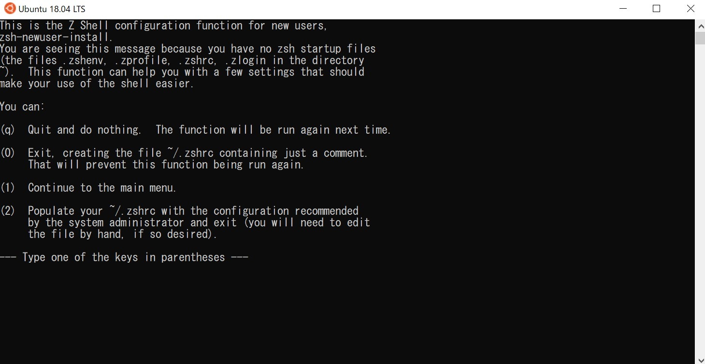

# Create your Workspace(Win)

自分のパソコンはMacじゃないって！？ 何とかしよう！！

## WSLをインストールする

まずは**管理者**の PowerShell またはコマンドプロンプトに次のコマンドを入力し、**再起動**します。

```powershell title="PowerShell"
wsl --install
```

再起動が終わった後、`Ubuntu`アプリが追加されているはずです。

起動してみましょう！

## Ubuntuの設定

Ubuntuが起動後、ユーザー名とパスワードを設定しましょう。

パスワードは**表示されない**ので打ちミスしないように気を付けましょう。

その後 Ubuntu をアップデートします。Ubuntu に文字を貼り付ける際は`Ctrl + Shift +V`を利用します。

```bash
sudo apt update -y && sudo apt upgrade -y
```

次に必要になるパッケージをインストールします。

```bash
sudo apt install -y make zsh libbsd-dev gcc libssl-dev libreadline-dev zlib1g-dev build-essential
```

その後、シェルを Bash から Zsh に切り替えます。

```bash
chsh -s /usr/bin/zsh
```

一度`exit`し、Ubuntuに入り直します。

下記のような画面が表示されるので`2`を押しましょう。



これで見覚えのある黒い画面が表示されましたね！
